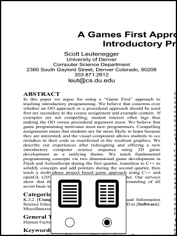

#TouchPDF
TouchPDF is a small and simple PDF viewer for the Nook Simple Touch&reg;.  You'll need to root your NST to install it.  It probably won't work on other devices because the controls are tied to the hardware buttons on the NST.  

TouchPDF is based on the vudroid library stripped to its bare essentials.  I call it a "viewer" instead of a "reader" because it treats documents as images, not text.  There's no selection or searching.  That seems fitting since I use my NST as a replacement for dead tree media.
  
One of TouchPDF's key features is a two-column reading mode designed for journal articles:

  